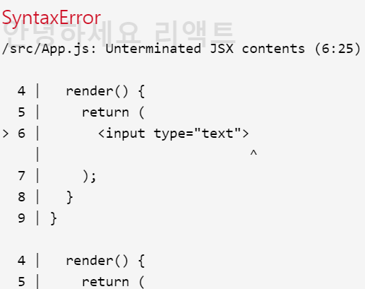
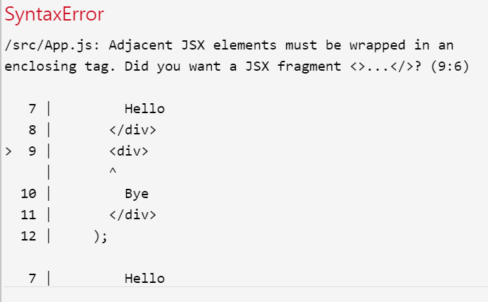

# JSX가 뭐죠

<code>JSX</code>에 대해 자세히 봐보면 얼핏 보기엔 <code>html</code>과 비슷해 보여서 금방 배울 수 있겠다고 생각했다ㅋㅋㅋ

 

<code>JSX</code>는 리액트 개발을 쉽게 하기 위해서, <code>HTML</code>과 비슷한 문법으로 작성을 하면 이를 <code>React.createElement</code>를 사용하는 자바스크립트 형태로 변환시켜준다.

 

<code>XML</code>형태의 코드를, 자바스크립트로 변환해야 하기 때문에, <code>JSX</code>를 제대로 사용하기 위해서 몇가지 규칙을 준수해야한다!

css와 svg를 지워주고


  // src/App.js
  import React, { Component } from 'react';

  class App extends Component {
    render() {
      return (
        

        

      );
    }
  }

  export default App;

 
 

## 꼭 닫혀야 하는 태그

태그는 꼭 닫혀있어야 한다! <code>div</code>태그를 열었으면, <code>/div</code>를 통하여 태그를 꼭! 닫아주어야 한다. 
<code>html</code>에서 <code>input</code>이나 <code>br</code>태그를 작성할 때 태그를 안닫을때도 있는데, 똑같이 리액트에서 한다면 오류를 겪게  된다.

 

 import React, { Component } from 'react';

  class App extends Component {
    render() {
      return (
        

          <input type="text">
        

      );
    }
  }

  export default App;



 
 

## 감싸져 있는 엘리먼트

두개 이상의 엘리먼트는 무조건 하나의 엘리먼트로 감싸져있어야 한다.


  // src/App.js
  import React, { Component } from 'react';

  class App extends Component {
    render() {
      return (
        

          Hello
        

        

          Bye
        

      );
    }
  }

  export default App;


터미널 쪽에서 오류가 나타나게 된다. 하나의 태그로 감싸져있어야 한다고 에러가 뜬다! 이를 해결하기 위한 가장 간단한 방법은 <code>div</code>로 감싸주는 것이다.

 

  import React, { Component } from 'react';

  class App extends Component {
    render() {
      return (
        

          

            Hello
          

          

            Bye
          

        

      );
    }
  }

  export default App;


그런데 가끔 어떠한 상황에서 무분별한 <code>div</code>를 사용하는게 마음에 들지 않을 수 있다! 예를들어 스타일을 제공할때 코드가 꼬일 수도 있고 <code>table</code>관련 태그를 작성할 때 번거로울 수도 있다.

그러한 상황엔 <code>Fragment</code>를 사용하면 된다!!!!!!!!!!!!


  import React, { Component, Fragment } from 'react';

  class App extends Component {
    render() {
      return (
        <Fragment>
          

            Hello
          

          

            Bye
          

        </Fragment>
      );
    }
  }

  export default App;


 
 

## JSX 안에 자바스크립트 값 사용하기

<code>JSX</code> 내부에서 자바스크립트 값을 사용 할 땐 이렇게 할 수 있다.

 

  import React, { Component } from 'react';

  class App extends Component {
    render() {
      const name = 'react';
      return (
        

          hello {name}!
        

      );
    }
  }

  export default App;


## 여기서 const란?

<code>const</code>는 <code>ES6</code>에 도입된 키워드로서, 한번 선언하고 바뀌지 않는 값을 설정할 때 사용된다.

그리고 바뀌게 될 수 있는 값은 <code>let</code>을 사용하여 선언한다.

_기존 자바스크립트의 var와 비슷하다고 생각하면 된다! 하지만 작동방식에 있어서 <code>scope</code>가 다르다!_

<code>var</code>는 <code>scope</code>가 함수단위인데,


  import React, { Component, Fragment } from 'react';

  class App extends Component {
    render() {
      return (
        <Fragment>
          

            Hello
          

          

            Bye
          

        </Fragment>
      );
    }
  }

  export default App;


 
 

## JSX 안에 자바스크립트 값 사용하기

<code>JSX</code> 내부에서 자바스크립트 값을 사용 할 땐 이렇게 할 수 있다.

 

  function foo() {
    var a = 'hello';
    if (true) {
      var a = 'bye';
      console.log(a); // bye
  }
  console.log(a); // bye
}  

 

반면 <code>const</code>와 <code>let</code>은 <code>scope</code>가 블록 단위이다.(모를...)


  function foo() {
    let a = 'hello';
    if (true) {
      let a = 'bye';
      console.log(a); // bye
    }
  console.log(a); // hello
}  

 

<code>var</code> <code>conset</code> <code>let</code>이 키워들을 어떨때 써야할지?

_ES6에서는, var를 쓸 일이 없다. 값을 선언 후 바꿔야 할 땐 let, 그리고 바뀌지 않을땐 const를 사용하면 된다._
 
 

## 조건부 렌더링

<code>JSX</code>내부에서 조건부 렌더링을 할 때는 보통 '삼항 연산자'를 사용하거나, 'AND연산자'를 사용한다.

반면에 <code>if</code>문을 사용할 수 없다.(사용하려면 <code>IIFE</code>즉시실행함수를 사용해야 한다.)

코드로 예시를 보면

 

삼항연산자


  import React, { Component } from 'react';

  class App extends Component {
    render() {
      return (
        

          {
            1 + 1 === 2 
              ? (
맞아요!
)
              : (
틀려요!
)
          }
        

      );
    }
  }

  export default App;
  


이렇게 하면 맞아요가 나온다. 그런데 <code>1 + 1 === 2</code> 부분을 <code>1 + 1 === 3</code> 으로 바꾼다면, 틀려요가 나타난다.

 

그 다음 'AND 연산자'를 사용해 본다면, '삼항연산자는' true일 때와 false일 때 다른것을 보여주고 싶을 때 사용하는 반면,

'AND 연산자'의 경우 단순히 우리의 조건이 true일 때만 보여주고 false 경우 아무것도 보여주고 싶지 않을때 사용 한다.


  import React, { Component } from 'react';

  class App extends Component {
    render() {
      return (
        

          {
            1 + 1 === 2 && (
맞아요!
)
          }
        

      );
    }
  }

  export default App;


대부분의 상황엔 위의 방식으로 해결할 수 있지만, 복잡한 조건을 작성해야 할때도 많을것이다.

그러한 조건들은 웬만하면 <code>JSX</code>밖에서 로직을 작성하는것이 좋다. 하지만 꼭 <code>JSX</code>내부에서 작성해야 한다면 'IIFE'를 사용한다.


  import React, { Component } from 'react';

  class App extends Component {
    render() {
      const value = 1;
      return (
        

          {
            (function() {
              if (value === 1) return (
하나
);
              if (value === 2) return (
둘
);
              if (value === 3) return (
셋
);
            })()
          }
        

      );
    }
  }

  export default App;


<code>if문</code>대신에 <code>switch문</code>을 사용해도 상관 없다. 그리고 위의 코드는 아래와 같이도 사용할 수 있다.


  (() => {
    if (value === 1) return (
하나
);
    if (value === 2) return (
둘
);
    if (value === 3) return (
셋
);
  })()  


위에 사용된 건 '화살표 함수'라고 부른다.
 

화살표 함수는 <code>this</code> <code>arguments</code> <code>super</code> 개념이 없는 익명의 함수이다.

ES6에서 자주 사용하게 될것이다.(no......)

 
 

## style과 className

<code>JSX</code>에서 style과 css 클래스를 설정할 때 <code>html</code>에서 하는것과 다르다.

우선 스타일은 다음과 같이 작성할 수 있다.


  import React, { Component } from 'react';

  class App extends Component {
    render() {
      const style = {
        backgroundColor: 'black',
        padding: '16px',
        color: 'white',
        fontSize: '36px'
      };

      return 
안녕하세요!
;
    }
  }

  export default App;


<code>html</code>에서는 그냥 텍스트 형태로 <code>="backgroundColor:black; padding:16px;..."</code>이런식으로 작성이 되어있다.

리액트에서는 객체 형태로 작성해주어야 한다.

그리고 클래스를 설정하게 될 때<code>html</code>에서는 <code> div class="hello" </code> 이렇게 작성이 됐었는데, 리액트 컴포넌트 에서는  <code>class</code>대신 <code>className</code>을 사용한다.


  import React, { Component } from 'react';
  import './App.css'

  class App extends Component {
    render() {
      return (
        

          리액트
        

      );
    }
  }

  export default App;  


이렇게.

 
 

## 주석


  import React, { Component } from 'react';

  class App extends Component {
    render() {
      return (
        

          {/* 주석은 이렇게 */}
          <h1
            // 태그 사이에
          >리액트</h1>
        

      );
    }
  }

  export default App;                 


위 처럼 <code>{/* ... */}</code>사이에 넣거나, 태그 사이에 넣을 수도 있다.

## 드디어 JSX 를 마치며...

아직 자바스크립트의 기본을 알지도 못하는 상태에서 공부해서 더 머릿속이 뒤죽박죽인 느낌이다. 과연 이렇게 병행하며 공부하는게 맞는걸까? 우선 와방 편한 건 알겠다.
