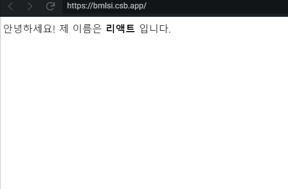

# Pros와 State

리액트 컴포넌트에서 다루는 데이터는 두개로 나뉜다. 바로 <code>props</code>와 <code>state</code>!

<code>props</code>는 부모 컴포넌트가 자식 컴포넌트에게 주는 값. 자식 컴포넌트에서는 <code>props</code>를 받아오기만 하고, 받아온 <code>props</code>를 직접 수정할 수는 없다.

<code>state</code>는 컴포넌트 내부에서 선언하며 내부에서 값을 변경할 수 있다.

## 새(NEW!) 컴포넌트 만들기


  import React, { Component } from 'react';

  class MyName extends Component {
    render() {
      return (
        

          안녕하세요! 제 이름은 <b>{this.props.name}</b> 입니다.
        

      );
    }
  }

  export default MyName;


자신이 받아온 <code>props</code>값은 <code>this.</code> 키워드를 통하여 조회할 수 있다. 지금 <code>name</code> 이라는 <code>props</code>를 보여주도록 설정해 주었다. 컴포넌트를 사용해보자. 연결하는 <code>App.js</code>에 다음과 같이 입력.


  import React, { Component } from 'react';
  import MyName from './MyName';

  class App extends Component {
    render() {
      return (
        <MyName name="리액트" />
      );
    }
  }

  export default App;


<code>import</code>를 통하여 컴포넌트를 불러오고, 렌더링을 해보자. 이렇게 컴포넌트를 만들고 나면 일반 태그를 작성하듯이 작성하면 된다.

그리고 <code>props</code>값은 <code>name="리액트"</code> 이런식으로 태그의 속성을 설정해주는것 처럼 해주고 브라우저를 확인해보면

 
 

## defaultProps

가끔씩 (나는 아마 자주) <code>props</code>를 빼먹을 때가 있을것이다. 혹은, 특정 상황에 <code>props</code>를 일부러 비워야할 때도 있다.

그럴땐 <code>props</code>의 기본값을 설정해 줄 수 있다. 그것이 바로 <code>defaultProps</code>!!


  import React, { Component } from 'react';

  class MyName extends Component {
    static defaultProps = {
      name: '기본이름'
    }
    render() {
      return (
        

          안녕하세요! 제 이름은 <b>{this.props.name}</b> 입니다.
        

      );
    }
  }
  export default MyName;
  


이렇게 하면 만약에 <code>MyName/</code>이런 식으로 name 값을 생략해 버리면 "기본이름"이 나타나게 될 것이다.

<code>defaultProps</code>는 다음과 같은 형태로도 설정할 수 있다.


  import React, { Component } from 'react';

  class MyName extends Component {
    render() {
      return (
        

          안녕하세요! 제 이름은 <b>{this.props.name}</b> 입니다.
        

      );
    }
  }

  MyName.defaultProps = {
    name: '기본이름'
  };

  export default MyName;


함수형 컴포넌트에서 <code>defaultProps</code>를 설정할땐 위 방식으로 하면 된다!

## 함수형 컴포넌트

단순히 <code>props</code>만 받아와서 보여주기만 하는 컴포넌트의 경우엔 더 간편한 문법으로 작성할 수 있다!

바로바로~ 함수형태로 작성하는건데 <code>MyName</code> 컴포넌트를 봐보면


  import React from 'react';

  const MyName = ({ name }) => {
    return (
      

        안녕하세요! 제 이름은 {name} 입니다.
      

    );
  };

  export default MyName;



보기엔 훨씬 간단해 보인다! 코드도 훨씬 깔끔하고! 그래서 어떻게 하는거쥬?

함수형 컴포넌트와 클래스형 컴포넌트의 주요 차이점은 <code>state</code>와 <code>LifeCycle</code>이 빠져있다는 거다.

그래서 컴포넌트 초기 마운트가 아주 미세하게 빠르고, 메모리 자원을 덜 사용한다. 미세한 차이여서 컴포넌트를 무수히 많이 렌더링 하게 되는게 아니라면 성능적으론 큰 차이가 없다!

 
 

## state 란?

동적인 데이터를 다룰때 <code>state</code>를 사용한다!


  import React, { Component } from 'react';

  class Counter extends Component {
    state = {
      number: 0
    }

    handleIncrease = () => {
      this.setState({
        number: this.state.number + 1
      });
    }

    handleDecrease = () => {
      this.setState({
        number: this.state.number - 1
      });
    }

    render() {
      return (
        

          <h1>카운터</h1>
          
값: {this.state.number}

          <button onClick={this.handleIncrease}>+</button>
          <button onClick={this.handleDecrease}>-</button>
        

      );
    }
  }

  export default Counter;


## state 정의

위의 코드를 보면, 컴포넌트의 <code>state</code>를 정의할 때는 [class fields](https://helloworldjavascript.net/pages/270-class.html) 문법을 사용해서 정의한다.

이 코드는 만약에 <code>class fields</code>를 사용하지 않는다면 다음과 같이 사용한다.


  import React, { Component } from 'react';

  class Counter extends Component {
    constructor(props) {
      super(props);
      this.state = {
        number: 0
      }
    }

    ...

  }


<code>class fields</code>를 사용하는건 편의를 위함이다. 
위 코드의 <code>constructor</code>에서 <code>super(props)</code>를 호출한 이유는 컴포넌트를 만들게 되면서, 
<code>Component</code>를 상속했으며 이렇게 <code>constructor</code>를 작성하게 되면 기존의 클래스 생성자를 덮어쓰게 된다. 
그렇기에 리액트 컴포넌트가 지니고있던 생성자를 <code>super</code>를 통하여 미리 실행하고, 그 다음에 할 작업(state설정)을 해주는 것이다. 
만약 <code>class fields</code>도 사용하고 <code>constructor</code>도 사용하게 된다면 어떤 부분이 늦게 설정되냐면 
<code>class fields</code>가 먼저 실행되고, 그 다음에 <code>constructor</code>에서 설정된것이 나온다. 

* Babel 에서 확인해보기! 

 
 

## 메소드 작성


  handleIncrease = () => {
      this.setState({
        number: this.state.number + 1
      });
    }

    handleDecrease = () => {
      this.setState({
        number: this.state.number - 1
      });
    }


컴포넌트에 메소드를 작성해주었다. 컴포넌트에서 메소드는 다음과 같은 형식으로도 작성할 수 있는데,


  handleIncrease() {
    this.setState({
      number: this.state.number + 1
    });
  }

  handleDecrease() {
    this.setState({
      number: this.state.number - 1
    });
  }


이렇게 하면, 나중에 버튼에서 클릭이벤트가 발생했을때 <code>this</code>가 <code>undefined</code>로 나타나서 제대로 처리되지 않게 된다. 
이는 함수가 버튼의 클릭이벤트로 전달이 되는 과정에서 <code>this</code>와의 연결이 끊겨버리기 때문인데 이를 고쳐주려면 <code>constructor</code>에서


  constructor(props) {
    super(props);
    this.handleIncrease = this.handleIncrease.bind(this);
    this.handleDecrease = this.handleDecrease.bind(this);
  }


처럼 해주거나 이전에 작성한 코드처럼 아예 화살표 함수 형태로 하면 this가 풀리는것에 대해서 걱정할 필요가 없다.

## setState
















